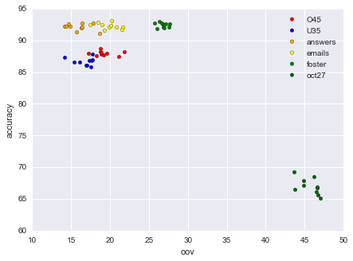
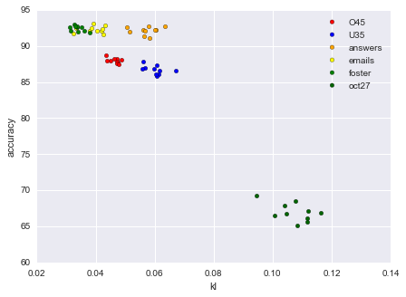
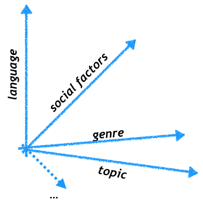

% Fortuitous data
% ESSLLI 2016, Day 1
% Željko Agić, Anders Johannsen, Barbara Plank 
# The course

## Motivation

Data is weird. Researchers make invalid assumptions. Results become inflated.

{ width=50% }

- One very good example. 

It used to be the case that language data = articles published in the Wall Street Journal around 1986.

## What if language technology could start over?

- Notion of canonical data.
- UD/Wall street bias. 
- Languages. 

**INSERT PICTURE OF DATASET PERFORMANCE WRT OOV/KL**
{ width=50% }
{ width=50% }

How would we avoid making the same mistakes again? Wikipedia is biased, social media commentary is biased. 

## General statement of the problem

Data mismatch. Train to application time mismatch. 

## The variety space

Where do our data come from. BP envisions a variety space:

$$\mathcal{D} \sim P(X, Y|V)$$

Is there such a variety space? What would the factors be?

. . .

{ width=50%, style="border: none"}

## Silly problem with simple solution?

### Annotate more?

Could we simply make sure that we annotate the right data? And more data. [@eisenstein:2013:bad]

Unsustainable, for many reasons. 

(We cannot annotate *enough* data for every single task that we wish to solve). 

### Map to canonical form?

Example: spelling normalisation. [e.g. @han:baldwin:2013]

A more powerful version of this is *invariant representations*. 

### Domain adaptation

Example: Importance weighting. 

Not final answer. Often, in reality, we don't know the target domain. And we don't like the term "domain". 

(Hal Daume, 2007 - or Weiss paper on transfer learning).

## Fortuitous data (this course)

**INSERT DEF OF THE WORD**

Annotate more: reuse data that was not explicitly annotated. 

Learn invariant representations of data.

Learn invariant representations of data.

# Overview of the course

The shape of things to come.

## Monday

### A typology of data mismatch
### Overview of semi-supervised learning

## Tuesday

### Structured prediction

## Wednesday

### your very own fortuitous learner (hands on).

## Thursday

### Learning from related tasks

## Friday

### Transfer learning in the extreme 

# Learning inside and outside the shire
# 

# References

