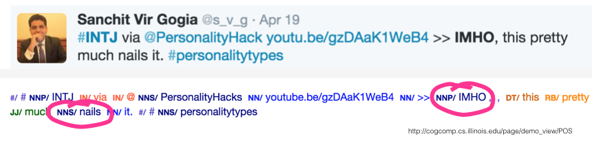
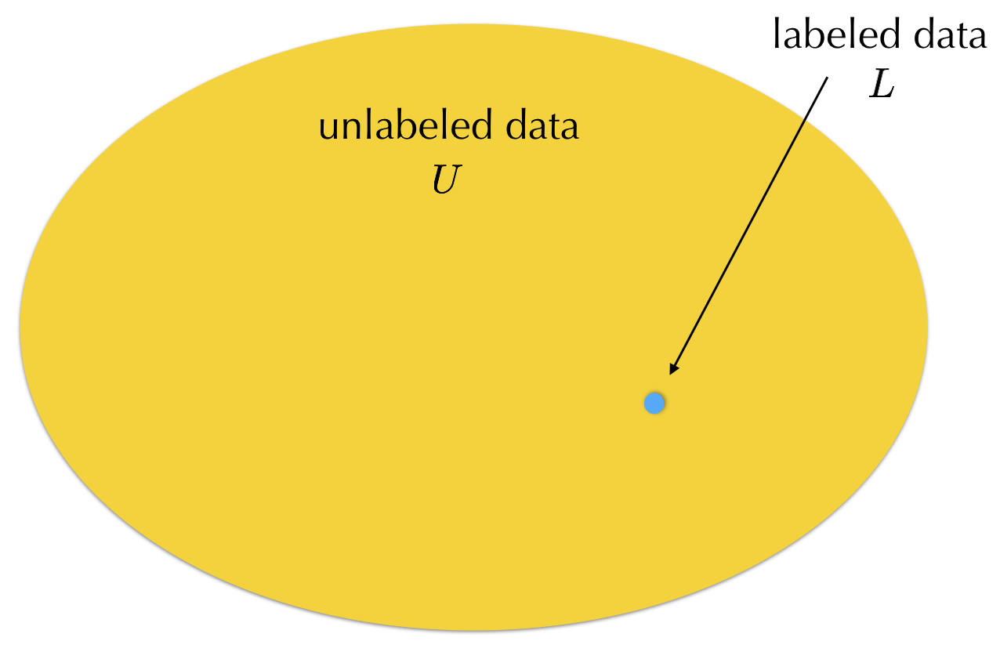
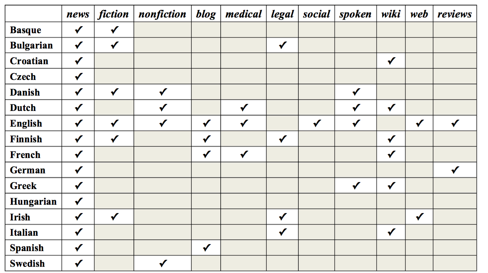
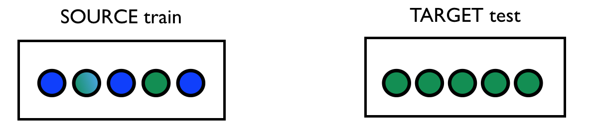
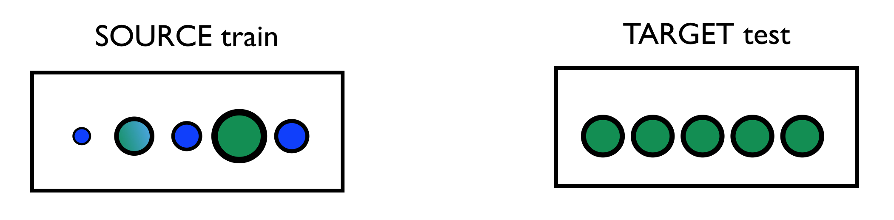

% Fortuitous data
% ESSLLI 2016, Day 1
% Željko Agić, Anders Johannsen, Barbara Plank 

# Getting to know each other

##  Željko Agić (read as: Zhelyko Aggich ☺)

{width=40% }

http://zeljkoagic.github.io/ 

&#64;zeljkoagic

## Anders Johannsen

{width=40%}

http://www.johannsen.com/ 

&#64;andersjo

## Barbara Plank

{width=40%}

University of Groningen

http://www.let.rug.nl/~bplank

&#64;barbara_plank

## Who are you?

. . .

<larger>

[http://bit.ly/2aVJVbs](http://bit.ly/2aVJVbs)

</larger>

# The course

# Motivation

## Ultimate goal: NLP for everyone

{ width=90% }

## The problem

{ width=90% }

## The reason

- NLP models are trained on samples from a **limited set of canonical data** 
- Mainly: English newswire
 
{ width=100% }

## Labeled data is **scarce**

. . .

{ width=90% }

## Labeled data is **biased**

. . . 

For a long while main resource: Wall Street Journal (WSJ), texts from late 80s.

{ width=60% }

<larger>
``*it is an uncomfortable fact that the text in **many of our most frequently-used corpora** was written and edited predominantly **by working-age white men***’’ [@eisenstein:2013:bad]
</larger>

## Still newswire?

![**Training data sparsity:** subset of treebanks from Universal Dependencies v1.2 [@UDLREC] for which domain/genre info is available [@plank:2016:konvens]](pics/domains-lang.png){ width=90% }

Data is weird. Researchers make invalid assumptions. Results become inflated.

- One very good example. 

It used to be the case that language data = articles published in the Wall Street Journal around 1986.

## What if language technology could start over?

- English newswire has advanced our field, but also introduced impercetible biases
- Why is newswire more **canonical** than other text types?
- If NLP could start over, what would be our canon?

- Notion of canonical data.
- UD/Wall street bias. 
- Languages. 
- what is considered canoncial hitherto is mostly a historical coincidence and motivated by the availablilty of resources. 

How would we avoid making the same mistakes again? Wikipedia is biased, social media commentary is biased. 

## Data mismatch - dichotomy:

{ width=100% }

- Train <> Test
- Source <> Target

Really a dichotomy?

## What’s in a **domain**?

POS tagging accuracies versus OOV rate/POS bigram KL divergence

{ width=49% }\ { width=49% }

## The variety space

- Where does our data come from?
- *Domain* is an overloaded term. 
  - In NLP typically used to refer to some coherent set of data from some topic or genre. 
- There are many other possible factors out there.

. . . 

Our datasets $\mathcal{D}$ are sampled from a **variety space**

<larger>
$$\mathcal{D} \sim P(X, Y|V)$$
</larger>

Is there such a variety space? What would the factors be?

## The variety space - illustration

- unknown high-dimensional space
- A domain (variety) forms a region in this space, with some members more prototypical than others (prototype theory, Wittgenstein, **graded** notion of category)

{ width=70%, style="border: none"}

# General statement of the problem

----

Whatever we consider **canonical**, the challenge remains: processing non-canonical data is hard. 

What are possible solutions?

## Silly problem with simple solution?

## Approach 1: Annotate more?

. . .

- Take cross-product between *domain* and *language* - huge space! 
- Our ways of communication change, so does our data; social media is a moving target [@eisenstein:2013:bad]

{ width=70% }

Unsustainable, for many reasons. 

Could we simply make sure that we annotate the right data? And more data. 

(We cannot annotate *enough* data for every single task that we wish to solve). 
- take language and domain; cross-product; huge space
- our ways of communication change, so does our data; social media is a moving target 
- there is data out there, however it's unlabeled

## Approach 2: Map to canonical form?

- Example: spelling normalisation [e.g. @han:baldwin:2013] ``u must be talkin bout the paper''
- However, what **norm**?

A more powerful version of this is *invariant representations*. 

## Approach 3: Domain adaptation

Example: Importance weighting. 

{ width=49% }

. . .

{ width=49% }

. . .

- Not final answer. 
- Many approaches [@daume:2007; @weiss2016survey], but unrealistic assumptions
- Often, in reality, we don't know the target domain. 

(Hal Daume, 2007 - or Weiss paper on transfer learning).

# Fortuitous data (this course)

## What means fortuitous?
{ width=100% }

## Fortuitous data 

Data that is out there, waits to be harvested (**availability**),
and can be used (relatively) easily (**readiness**)

## Fortuitous data to the rescue

- Annotate more: reuse **data that was not explicitly annotated**. 

- Normalization: With sufficient data learn **invariant representations**.

- Domain adaptation: **Gather data of new varieties quickly**, or use additional signal to build more robust models.

## Typology of fortuitous data

- **Side product of user-generated content** (e.g., hyperlinks, HTML markup, large unlabeled data pools), availability: +, readiness: + 

. . .

- **Side product of annotation** (e.g., annotator disagreement), availability: -, readiness: +

. . .

- **Side product of behavior** (e.g., cognitive processing data), availability: +, readiness: -

## Fortuitous approaches

Combine fortuitous **data** with proper **models** to enable adaptive language technology.

# Overview of the course

The shape of things to come.

## Monday

### A typology of data mismatch
### Learning in the shire

## Tuesday

### Structured prediction

## Wednesday

### your very own fortuitous learner (hands on).

## Thursday

### Learning from related tasks

## Friday

### Transfer learning in the extreme 

# Learning inside and outside the shire
# 

# References

## References {.allowframebreaks}
