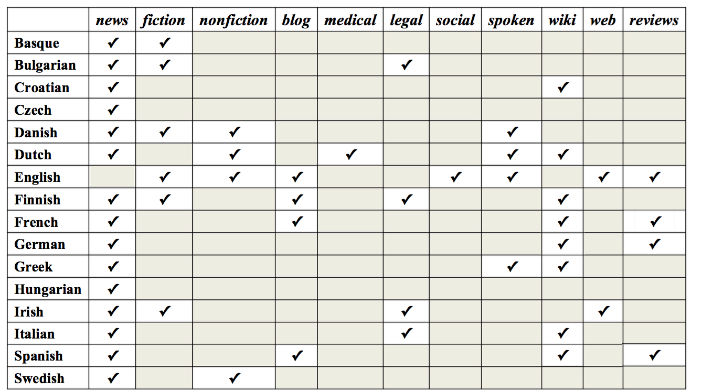
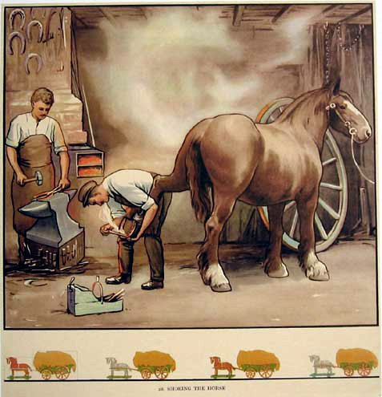
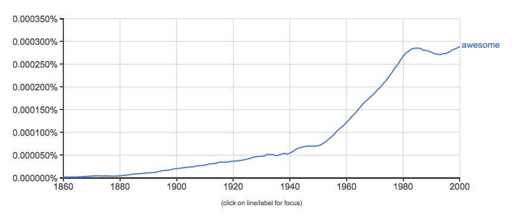

% Fortuitous data
% ESSLLI 2016, Day 1
% Željko Agić, Anders Johannsen, Barbara Plank 

# Getting to know each other

##  Željko Agić (read as: Zhelyko Aggich ☺)

{width=40% }

IT University of Copenhagen

http://zeljkoagic.github.io/ 

zeljko.agic@gmail.com

## Anders Johannsen

{width=30%}

Apple

anders@johannsen.com

## Barbara Plank

{width=40%}

University of Groningen

http://www.let.rug.nl/~bplank

bplank@gmail.com

## Who are you?

. . .

<larger>

[http://bit.ly/2aVJVbs](http://bit.ly/2aVJVbs)

</larger>

# The course

# Motivation

## Ultimate goal: NLP for everyone

{ width=90% }

## The problem

{ width=90% }

## The reason

- NLP models are trained on samples from a **limited set of canonical data** 
- Mainly: English newswire
 
{ width=100% }

give intuition, later more

## Labeled data is **scarce**

. . .

{ width=90% }

## Labeled data is **biased**

. . . 

For a long while main resource: Wall Street Journal (WSJ), texts from late 80s.

{ width=60% }

<larger>
``*it is an uncomfortable fact that the text in **many of our most frequently-used corpora** was written and edited predominantly **by working-age white men***’’ [@eisenstein:2013:bad]
</larger>

## Still newswire?

![**Training data sparsity:** subset of treebanks from Universal Dependencies v1.2 [@UDLREC] for which domain/genre info is available [@plank:2016:konvens]](pics/domains-lang.png){ width=90% }

Data is weird. Researchers make invalid assumptions. Results become inflated.

- One very good example. 

It used to be the case that language data = articles published in the Wall Street Journal around 1986.

## What if language technology could start over?

- English newswire has advanced our field, but also introduced impercetible biases
- Why is newswire more **canonical** than other text types?
- If NLP could start over, what would be our canon?

- Notion of canonical data.
- UD/Wall street bias. 
- Languages. 
- what is considered canoncial hitherto is mostly a historical coincidence and motivated by the availablilty of resources. 

How would we avoid making the same mistakes again? Wikipedia is biased, social media commentary is biased. 

## Data mismatch - dichotomy:

{ width=100% }

- Train <> Test
- Source <> Target

Really a dichotomy?

## What’s in a **domain**?

{ width=80% }

----

{ width=80% }

## The variety space

- Where does our data come from?
- *Domain* is an overloaded term. 
  - In NLP typically used to refer to some coherent set of data from some topic or genre. 
- There are many other possible factors out there.

. . . 

Our datasets $\mathcal{D}$ are sampled from a **variety space**

<larger>
$$\mathcal{D} \sim P(X, Y|V)$$
</larger>

Is there such a variety space? What would the factors be?

## The variety space - illustration

- unknown high-dimensional space
- A domain (variety) forms a region in this space, with some members more prototypical than others (prototype theory, Wittgenstein, **graded** notion of category)

{ width=70%, style="border: none"}

# General statement of the problem

----

Whatever we consider **canonical**, the challenge remains: processing non-canonical data is hard. 

What are possible solutions?

## Silly problem with simple solution?

## Approach 1: Annotate more?

. . .

- Take cross-product between *domain* and *language* - huge space! 
- Our ways of communication change, so does our data; social media is a moving target [@eisenstein:2013:bad]

{ width=70% }

Unsustainable, for many reasons. 

Could we simply make sure that we annotate the right data? And more data. 

(We cannot annotate *enough* data for every single task that we wish to solve). 
- take language and domain; cross-product; huge space
- our ways of communication change, so does our data; social media is a moving target 
- there is data out there, however it's unlabeled

## Approach 2: Map to canonical form?

- Example: spelling normalisation [e.g. @han:baldwin:2013] ``u must be talkin bout the paper''
- However, what **norm**?

A more powerful version of this is *invariant representations*. 

## Approach 3: Domain adaptation

Example: Importance weighting. 

{ width=49% }

. . .

{ width=49% }

. . .

- Not final answer. 
- Many approaches [@daume:2007; @weiss2016survey], but unrealistic assumptions
- Often, in reality, we don't know the target domain. 

(Hal Daume, 2007 - or Weiss paper on transfer learning).

# Fortuitous data (this course)

## Define fortuitous!
{ width=100% }

## Fortuitous data 

Data that is out there, waits to be harvested (**availability**),
and can be used (relatively) easily (**readiness**)

## Fortuitous data to the rescue

- Annotate more: reuse **data that was not explicitly annotated**. 

- Normalization: With sufficient data learn **invariant representations**.

- Domain adaptation: **Gather data of new varieties quickly**, or use additional signal to build more robust models.

## Typology of fortuitous data

- **Side benefit of user-generated content** (e.g., hyperlinks, HTML markup, large unlabeled data pools), availability: +, readiness: + 

. . .

- **Side benefit of annotation** (e.g., annotator disagreement), availability: -, readiness: +

. . .

- **Side benefit of behavior** (e.g., cognitive processing data), availability: +, readiness: -

## Fortuitous approaches

Combine fortuitous **data** with proper **models** to enable adaptive language technology.

# Overview of the course

The shape of things to come.

## Monday

### A typology of data mismatch
### Learning in the shire

## Tuesday

### Structured prediction

## Wednesday

### your very own fortuitous learner (hands on).

## Thursday

### Learning from related tasks

## Friday

### Transfer learning in the extreme 

# Transfer intution

## Learning to ride

How can we hope to use data from other tasks where both the input and output spaces are different? 

. . .

Let's say you want to learn how to ride a motorcycle, and you already know how to drive a car. 

------

First observation: motorcycle driver's licenses are *cheaper* if you already have an ordinary driver's license.

The market believes in transferable skills!

------

Input space: what you observe on the road

Output space: actions that you can take, like changing gears, speeding up, breaking, etc.

<aside class="notes">
Input space mostly the same. 
Output space somewhat different. 
</aside>

------

Some traffic skills are independent of the mode of transport.

<aside class="notes">
- What is the meaning of the traffic light. 
- Can I expect these other drivers to not drive in front of me. 
</aside>

In general, your internal model of how traffic works is transferable. 

-----

Some skills are unique to driving a motorcycle. 

. . .

You typically don't have to worry about this when stopping in a car. 

-----

## Caution

For a car it’s best to stop when the light changes to yellow. 

. . .

On a motorcycle suddenly applying the brakes can be fatal, because the car or truck behind you might decide to just continue.  

This is a case of **negative transfer**. 

# Part 1: The shire

------

## A static world

The shire is a quiet and wonderful place, with jolly and content people inhabiting its rolling green hills and quaint villages. 

The only kind of horse that lives in the shire is the stout Hackney pony. At no point will you be asked to shoe a Belgian horse, or mend a broken bike wheel. 

**Wouldn’t it be great if we actually all lived in the shire?**

## The shire assumption

Machine learning theory assumes that the world behaves predictably like the shire. 

This assumption is what gets us nice things like theoretical generalisation bounds.

. . .

$\implies$ **there is no generalisation theory outside the shire.**

<aside class="notes">
We'll first describe what amount to a classical setting, then point out some differences. 
</aside>

## Input and output
 
The goal of supervised machine learning is to find a function $h$ that maps from some percept or input $x$ to a label $y$. 

- $x$ is a credit application, $y$ the outcome. 

- $x$ is a tweet, $y$ its sentiment.

- $x$ is a sentence, $y$ the syntactic parse tree. (Tomorrow).

<aside class="notes">
What $x$ and $y$ are depends on the task. Many banks, for instance, use a learned function to decide whether to give credit to a customer or not. 
</aside>

-------

Let $x \in \mathcal{X}$ (input space) and $y \in \mathcal{Y}$ (label space).

NLP applications almost always have **discrete** output spaces. 

In these lectures, $y$ will either be an integer (for classification) or a vector of integers (for structured prediction). 

## Target and hypothesis function

There is an **unknown target function** solving our problem:

$$f: \mathcal{X} \mapsto \mathcal{Y}$$

<aside class="notes">
Of course, $f$ doesn’t really exist anywhere, yet it's a useful fiction. 
</aside>

. . .

Goal: learn a **hypothesis function** $h$ that is as close as possible to the target function.

$$h: \mathcal{X} \mapsto \mathcal{Y}$$

## Dataset 

It gets worse before it gets better.

We also don't know the true distribution of our inputs. $P(X)$ is unknown.

<aside class="notes">
We don’t know which tweets will be written or the kinds of backgrounds people who apply for credit will have.   
</aside>

. . .

Supervised learning rests on the idea that we can get a **finite sample**

$$x_1, \ldots, x_n \sim P(X)$$

from the unknown input distribution $P(x)$, and that we can (somehow) evaluate $f$ on these examples. 

---------

Putting this together yields the concept of a **training set**:

$$\mathcal{D}_t = \{(x_1, f(x_1) ), \ldots (x_n, f(x_n)) \}$$

How do we gain access to the unknown target function? 

<aside class="notes">
The bank might look at past credit applications together with the decisions. In NLP we often ask *people* to annotate.
We are not trying to solve a problem with no known solution. People and procedures already implement $f$.
</aside>

------------

## Big data sale 

- Available: large sample from $P(x)$. No labels included. 

. . .

- Available: large sample from $P(x)$. Weird labels included.

. . .

The setting in which there are no labels at all is called **unsupervised learning**. 

When unlabeled data is available in addition to a labeled dataset this is **semi-supervised learning**. 

These concepts are a little less useful in transfer learning / multi-task learning. 

<aside class="notes">
This is the promise of big data. Unannotated or wrongly annotated data. 
Or automatically annotated data from user processes. 
There's no canonical name for the weird labels scenario.
</aside>

## Comparable representations

We wish to learn from the past, but:

- We'll never see the same tweet twice, hopefully. 

- When a failed credit application is resubmitted, the customer’s circumstances have changed, and so the application isn’t the same anymore. 

“You cannot submit a credit application twice,” as Heraclitus might have said. 

-----

We wish to learn from the past, but whatever happened will not happen *exactly* like that again. Something *similar* might happen.

<aside class="notes">
Need a way to break up our observations (the $x$es) to make them comparable even if the don’t match exactly.
The $x$ are not 
</aside>

------

## Feature space

Observations decompose into **features** in some **feature space** $\mathcal{F}$. 

Each input example is transformed into a suitable **input representation** for the learning algorithm by a **feature function** $\Phi(x)$. 

The feature function $\Phi(\cdot)$ maps examples from the input space to the feature space:

$$\Phi: \mathcal{X} \rightarrow \mathcal{F}$$

------

Typically, the $\Phi(x)$ is a real-valued vector of some fixed dimension $d$:

$$\mathcal{F} = \mathbb{R}^d$$

The $\Phi$ feature function is deterministic and not a part of the learner. 

. . .

Traditional NLP: find better $\Phi$ for specific tasks by hand.

Feature representations are also a theme in this course, but the flavour will be different. 

<aside class="notes">
Even though the learner might not have seen the new example exactly, it might have seen similar examples (or parts of the current example), and thus still be able to make a prediction.
</aside>

## Latent space

We've seen three kinds of spaces already: input space, feature space, and label space. 
Now, tada, the **latent space** where the model's *internal* representations live.

### Example: word embeddings

Embeddings are not model output. 
They are latent state in a model that is doing something else. 
A side benefit of optimising another objective. 

---------

### Notation

We introduce a latent space $\mathcal{Z}$. We use two extra functions:

- $j: \mathcal{X} \mapsto \mathcal{Z}$ from feature to latent.
- $k: \mathcal{Z} \mapsto \mathcal{Y}$ from latent to label,

and define h as the composition of $j$ and $k$: 

$$h = j \circ k$$. 

## Example: $h$ is linear

The shape of $h$ depends on our choice of **hypothesis class**, that is which kind of learner we will be using. 

A simple example is the linear hypothesis class for binary classification:

$$\tilde y = h(x; \theta, b) = \text{sign}( \theta^\top \Phi(x) + b)$$ 

This example shows how the parameters $\theta$ and $b$ of the model are combined with the feature representation produced by $\Phi(x)$. 

<aside class="notes">
Other hypotheses classes (e.g. neural networks) compute more complicated expressions, meaning that they have richer internal structure, but typically use the input in a similar way to here.
</aside>

## Suggestion

It’s a great summer; we’re young, and it feels like the nights extend indefinitely. Let’s use some of that time to write down a parameter vector $\theta$ that classifies all the examples in our training set *perfectly*. 

Is that a good choice of parameter vector? 

**Or would we become bitter as we grow old, looking back on a summer of wasted opportunity?**

-----

Not important how $h$ performs on the training data. It could have simply remembered all of the answers. 

We are interested in a system that is able to **generalize**. It needs to represent the regularities of the data **compactly**. 

<aside class="notes"> 
Generalisation and learning amount to pretty much the same thing. 
You need to compress the data: find a more compact way of encoding the regularities in the data. 
It should provide reasonable outputs even for examples the it hasn’t seen before. 
</aside>

## Evaluate on unseen data

Evaluation uses **unseen data**. Given a new fresh $x$, $h$ makes a prediction 

$$\tilde y = h(x)$$

The system incurs a **loss** (the cost of the prediction) $l(y,\hat{y})$ which is typically $0$ if the predicted label is correct, and $>0$ otherwise (if $y\ne \tilde y$).

## Summary, inside the shire:

Given training and evaluation data:

$$\mathcal{D}_t = \{(x_1, f(x_1) ), \ldots, (x_n, f(x_n)) \} \sim P(X)$$
$$\mathcal{D}_e = \{(x_1, f(x_1) ), \ldots, (x_m, f(x_m)) \} \sim P(X)$$

Learn a parameterised function $h$ to approximate $f$.

$$\tilde \theta = \arg \min_{\theta} \sum_{(x, y) \in \mathcal{D}_t} l(y, h(\Phi(x); \theta))$$

Estimate generalisation error using $\mathcal{D}_e$.

# Part 2: Outside the shire

-----

## This is not what we trained for

A number of things can go wrong outside the shire.

All of a sudden the horses are not ponies anymore. 

. . .

Shire assumption:

- Train: $\mathcal{D_t} \sim P(X)$
- Eval: $\mathcal{D_e} \sim P(X)$

Mordor reality:

$$P_t(X) \neq P_e(X)$$

## Input distributions differ

**Condition**: $P_t(X) \neq P_e(X)$ 

Case: Language changes. A word like “awesome” has become much more frequent, perhaps losing some of its former oomph, but not fundamentally changing meaning.  

. . .

Say you learned a sentiment model on English music reviews from 1960 and wished to apply it *now*. What would happen?

<aside class="notes">
*(Speculation)* Probably your 1960 model would have learned to pay very close attention when that word “awesome” occurred, dramatically increasing the score for positive sentiment. Now “awesome” might occur in a review several times without the record actually being special. 
</aside>

## Output distributions differ

**Condition**: $P_t(Y) \neq P_e(Y)$

Case: Corporate IT projects in banks run for a long time. Suppose you were a British bank and used your recorded credit application history from before Brexit for the loan classifier you are using today. The market is insecure, and the bank would like to approve fewer application to reduce its overall risk.

. . .

Here the label distribution has changed:

$$P_t(Y=\text{Approved}) > P_e(Y=\text{Approved})$$ 

This could happen without the criteria for evaluating loan risk changing. 

## Conditional distributions differ

**Condition**: $P_t(Y|X) \neq P_e(Y|X)$

Case: The dust has not yet settled on Brexit. Two groups of people with particularly uncertain prospects are foreigners in Britain, and Britons in Europe. Say a British family moved to Berlin and wished to purchase a property in Prinzlauerberg. Would the fact that they are British alter their chances of getting a loan, without necessary affecting anyone else? 

<aside class="notes">
Example from sentiment analysis. The adjective “small” might be negative in car review but positive when it describes a compact cell phone. In this case we have **negative transfer**. 
</aside>

## General setting

- Single **target task**.
- One or more **source datasets**. 

. . .

Target task: a label space $\mathcal{Y}$, an input distribution $P(x \in \mathcal{X}_t)$, and a loss $l(y, \tilde{y})$.

. . .

Source dataset: minimally a sample from $P(x \in \mathcal{X}_s)$. 

. . .

But often labeled data, induced classifiers, latent representations from the classifiers, and so on. 

**No requirement that $\mathcal{X}_t = \mathcal{X}_s$ or $\mathcal{Y}_t = \mathcal{Y}_s$.**

<aside class="notes">
No requirement that the input and output spaces for the various source datasets are the same, or indeed that they coincide with the input and output spaces of the target task. As an example, the output of a source learner could be integrated in the feature function of the target task.
</aside>

## Awaky

](pics/fishes.jpg){width="700px"}

Classic machine learning setting: **fish classification**. 

------

What events could cause:

- $P_t(X) \neq P_e(X)$,
- $P_t(Y) \neq P_e(Y)$, and
- $P_t(Y|X) \neq P_e(Y|X)$?

-------

### Bonus question

You're a tech-savyy fusion sushi chef and want to try out new ingredients. 
So you build a binary classifier to help you decide. You friend works in the factory 
and used this new tool `fish2vec` to extract latent fish representations (fish embeddings). 
Could they be helpful in your task?

. . .

Another friend trained `fish2vec` on an recipe database.  Does it matter which ones you use?

# References

## References {.allowframebreaks}
