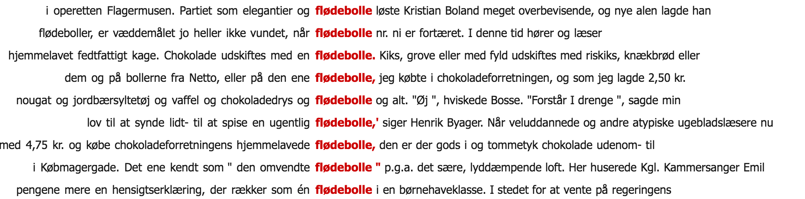

% Fortuitous data
% ESSLLI 2016, Day 3

# Representations and learning from related tasks

## Today

1. Quick intro to neural Networks: Learning and Computational graph
2. Representations and first fortuitous tricks
4. Multi-task learning
5. More fortuitous data 
    * Part-of-speech tagging with bi-LSTMs and auxiliary loss
    * Keystroke dynamics as source for syntactic chunking

----

# Neural Networks - Graph view

After this part you should:
* know about the different equivalent formulizations of a neural network 
* understand the computational graph abstraction

## Feed-forward Neural Network

 $$y= NN(\mathbf{x}) $$

input: $\mathbf{x}$ (vector with $d_{in}$ dimensions)

output: $\mathbf{y}$ (output with $d_{out}$ classes)

----

## Example

Formalization and corresponding visualization:

$$NN_{MLP1}(\mathbf{x})=g(\mathbf{xW^1+b^1})\mathbf{W^2}+\mathbf{b^2}$$

## Where do the weights come frome?

It's an **optimization** problem. 

{width=60%}

. . .

We need:

1. a loss function $l(\tilde y, y)$
2. a way to change the model (parameters) to get closer to a good model (hint: SGD)

## Minimize loss using gradient-based method

## Skeleton of gradient descent:
    
**Input**: training set, loss function $L$

Repeat for number of iterations (**epochs**): 
 
* compute loss on data: $L(X,Y)$
* compute gradients: $\mathbf{g} = L(X,Y)$ with respect to $w$
* move parameters in direction of the negative gradient: $w \pm -\eta \mathbf{g}$

## Computational Graph

Way of computing the **gradients**: **backprop**

A powerful way to compute these gradients is to see the network as a  **computational graph**.

It helps us to understand the flow in the model:

* forward pass: compute activations
* backward pass: gradient computations (chain rule) 

----

In a computational graph:

- nodes are operations
- gray boxes are parameters

$$NN_{MLP1}(\mathbf{x})=g(\mathbf{xW^1+b^1})\mathbf{W^2}+\mathbf{b^2}$$

{ width=20%}

-----

## Equivalent formulizations 

{ width=80%}

----

. . .

However, what is the input **$x$**?

## Feature representation

Probably the biggest jump when moving from traditional linear models with sparse inputs to deep neural networks is to stop representing each feature as a unique dimension, but instead represent them as **dense vectors** [@goldberg-primer].

. . . 

**discrete representation**

$$\mathbf{x}_{cat} = [0,0,0,0,0,0,1] $$
$$\mathbf{x}_{dog} = [0,0,0,0,1,0,0] $$

**similarity** on discrete representations? 

. . .

$$\mathbf{x}_{cat} \wedge \mathbf{x}_{dog} = 0$$

## Word embeddings

**"You shall know a word by the company it keeps"** (Firth, J. R. 1957:11)

----

----

1. Traditional approach: LSA (SVD) on word-coocurrence matrix
2. word2vec

----

## LSA - Latent Semantic Analysis (Singular Value Decomposition - SVD)

Approximate a matrix $\mathbf{C}$ through a decomposition into three submatrices (**of smaller dimensionality**):

$$\mathbf{C} \approx \mathbf{U \sum V^T}$$

NB. $=$ should be $\approx$

----

## 

## Challenge

How can we hope to use **data from other tasks** where potentially **both the input and output spaces are different**? 

----

### Example 1: Card game

- you are in beautiful Italy and want to get acquainted with local card games. You hear about 'scala 40', and are eager to learn it

The input space are cards, and the output space are configuations (hands) of your cards. You seem acquainted with the type of input space, but the rules have changed. Luckily you know already how to play poker. Rather than starting from scratch (tabula rasa), you use your internal knowledge of poker (or generally how to play a card game) to learn how to play 'scala 40', you can quicker get what are valiable configurations (possible outputs) for the new game.

{width=40%}

----

### Example 2: riding a motorcycle (day 1)

Here input and output space are different. 

Some skills are unique to driving a motorcycle (need for hand for the clutch, to worry not to tip over when stopping, etc). However, you can use your internal knowledge of how to drive a car in order to learn how to drive a motorcycle. 

# Multi-task learning

## Key idea

The idea of **multi-task learning** (Caruana, 1997; Collobert et al., 2011) to exploit the training signal of **other tasks**. 

But before we go into MTL, lets recap learning for a single task.

## Single task neural networks

The figure shows three **separate** feedforward neural networks for three different tasks.

# Recap: Learning 

todo

# References

## References {.allowframebreaks}
